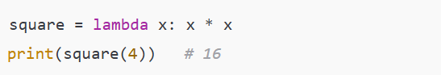
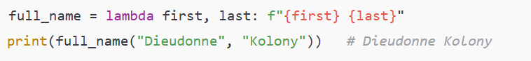
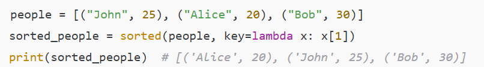

# ⚡ Lambda Function in Python

- A **lambda function** is an **anonymous function** (no name).
- Can take **multiple arguments** but must have **only one expression**.
- Often used for **short, throwaway functions**.
- Similar to **arrow/anonymous functions in JavaScript**.
- Commonly used inside:
  - `map()`
  - `filter()`
  - `reduce()`
  - Sorting with `key` parameter

---

## 🔹 Syntax

```python
lambda arguments: expression
```

## 🔹 Key Points to Remember

    - No def keyword, only lambda.
    - Always returns the result of the expression (no return needed).
    - Best used when the function is simple and short.
    - Not a replacement for normal functions (def) if logic is complex.

# Examples

1. Single Expression
   

2. Multiple Arguments
   

3. Used in map()
   .png>)

4. Used in Sorting
   

# ✅ Rule of Thumb:

- Use lambda for one-liners and temporary helper functions.
- Use def when your function needs clarity, reuse, or multiple statements.
